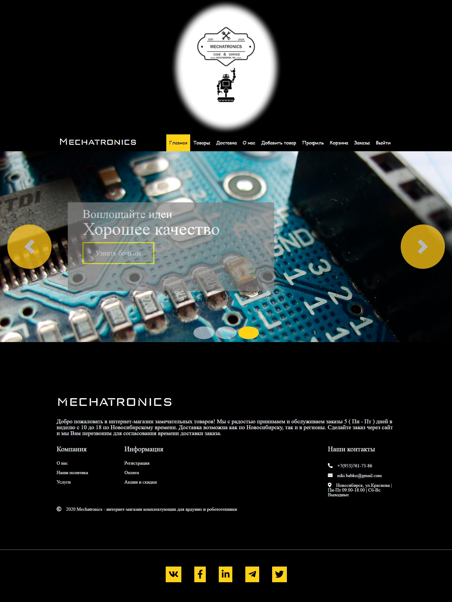

# &#128187; Hello coders

## &#x1F4D8; About project

It's online shop for selling arduino components

### Where and what is located (files, folders).

- Folder "db_files" - mongo db files
- Folder "emails" - feedback for user
- Folder "keys" - keys
- Folder "middleware" - supporting elements
- Folder "models" - models for DB
- Folder "public" - source elements
- Folder "routes" - routes
- Folder "src" - scss files
- Folder "views" - html ( handlebars ) files

&#x1F534; You can also see the used dependencies in "package.json"

## Getting started

Download project and using npm at the project's root:

`npm install` or `yarn install`

Next &#x1F53D;

Run the project-server can be a command `npm run dev` or `yarn dev`

## &#129534; About me

### My contacts:

- name: Nikita
- sername: Babko
- email: niki.babko@gmail.com

#### I also have social network

- [facebook](https://www.facebook.com/nikita.babko?ref=bookmarks)

- [telegram](https://t.me/White_Rabbit_AI)

- [twitter](https://twitter.com/white_rabbit_ai)

- [linkedin](https://www.linkedin.com/in/%D0%BD%D0%B8%D0%BA%D0%B8%D1%82%D0%B0-%D0%B1%D0%B0%D0%B1%D0%BA%D0%BE-621618186/)
